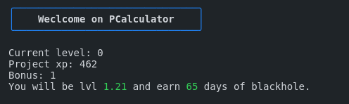

# PCalculator

Hi! Welcome on PCalculator. This is a program that calculate your level and the blackhole you will receive after pushing a project.



## Install

To install PCalculator you need to clone the repository in your 'home' directory.

```bash
  cd && git clone https://github.com/0Slaye/pcalculator.git
```
Next you can start the 'setup.sh' script that will add PCalculator as an alias in your '.zshrc'.
```bash
  cd pcalculator && ./setup.sh
```
Finaly, don't forget to reload your '.zshrc' with this command.
```bash
  source .zshrc
```

## How to use

To correctly use PCalculator you will need to give somes specials informations.
```bash
  Current level [0.0/10.0]: [YOUR LEVEL] # 0
  Project xp [0/63000]: [PROJECT XP] # 462
  Bonus [0/1]: [0=NO] [1=YES] # 1
```

## Resources

[42 Evalutator - Benjaminmerchin](https://medium.com/@benjaminmerchin/42-black-hole-deep-dive-cbc4b343c6b2)

## License

[CC0](https://choosealicense.com/licenses/cc0/)
